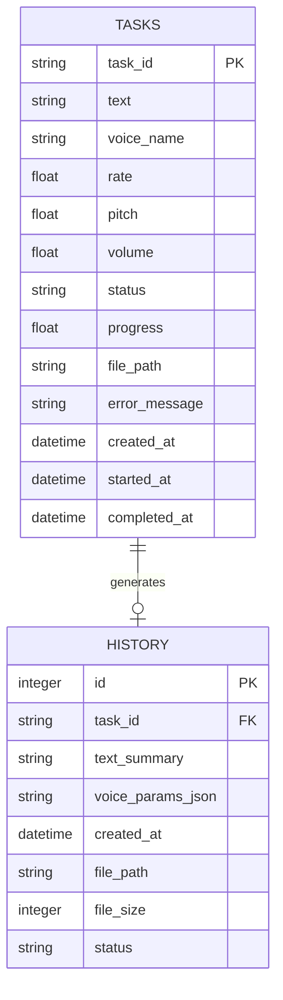

# Data Model & Schema

**Feature**: 离线文字转语音工具 (001-offline-tts)
**Date**: 2026-01-24
**Database**: SQLite 3.x (SQLAlchemy 2.0 ORM)

## Overview

本文档定义了离线TTS工具的数据库模型、实体关系、验证规则和状态转换。数据模型使用SQLAlchemy 2.0异步ORM定义,存储在SQLite数据库中(`data/tts_history.db`)。

---

## Entity Relationship Diagram



**关系说明**:
- `TASKS` 表存储所有生成任务(包括排队、处理中、已完成)
- `HISTORY` 表存储已完成的任务历史(最多20条)
- 一对一关系: 每个完成的任务在历史记录中有对应记录
- 任务完成后,自动创建历史记录并清理旧记录

---

## Database Tables

### 1. tasks (任务表)

存储所有TTS生成任务,包括排队中、处理中、已完成、失败和已取消的任务。

#### Schema Definition

| Column | Type | Constraints | Description |
|--------|------|-------------|-------------|
| task_id | VARCHAR(36) | PRIMARY KEY | 任务唯一标识符(UUID) |
| text | TEXT | NOT NULL | 要转换的文本内容 |
| voice_name | VARCHAR(50) | NOT NULL, DEFAULT '晓晓-女声' | 音色名称 |
| rate | FLOAT | NOT NULL, DEFAULT 1.0 | 语速倍率 (0.5-2.0) |
| pitch | FLOAT | NOT NULL, DEFAULT 1.0 | 音调倍率 (0.5-2.0) |
| volume | FLOAT | NOT NULL, DEFAULT 1.0 | 音量倍率 (0.0-1.0) |
| status | VARCHAR(20) | NOT NULL, DEFAULT 'queued' | 任务状态 |
| progress | FLOAT | NOT NULL, DEFAULT 0.0 | 进度百分比 (0.0-100.0) |
| file_path | VARCHAR(255) | NULLABLE | 生成的音频文件路径 |
| error_message | TEXT | NULLABLE | 错误信息 |
| created_at | TIMESTAMP | NOT NULL, DEFAULT CURRENT_TIMESTAMP | 任务创建时间 |
| started_at | TIMESTAMP | NULLABLE | 任务开始处理时间 |
| completed_at | TIMESTAMP | NULLABLE | 任务完成时间 |

#### Status Enum

任务状态的枚举值和转换规则:

```python
class TaskStatus(str, enum.Enum):
    QUEUED = "queued"        # 排队中
    PROCESSING = "processing" # 处理中
    COMPLETED = "completed"   # 已完成
    FAILED = "failed"        # 失败
    CANCELLED = "cancelled"   # 已取消
```

**状态转换规则**:
```
[queued] → [processing] → [completed]
              ↓               ↓
           [cancelled]      [failed]
```

#### Validation Rules

- `text`: 长度 1-5000 字符
- `voice_name`: 必须在预设音色列表中
- `rate`: 范围 0.5 - 2.0
- `pitch`: 范围 0.5 - 2.0
- `volume`: 范围 0.0 - 1.0
- `progress`: 范围 0.0 - 100.0

#### Indexes

```sql
CREATE INDEX idx_tasks_status ON tasks(status);
CREATE INDEX idx_tasks_created_at ON tasks(created_at DESC);
```

---

### 2. generation_history (生成历史表)

存储已完成的TTS任务历史记录,最多保存20条(FIFO自动清理)。

#### Schema Definition

| Column | Type | Constraints | Description |
|--------|------|-------------|-------------|
| id | INTEGER | PRIMARY KEY, AUTOINCREMENT | 记录ID |
| task_id | VARCHAR(36) | NOT NULL, UNIQUE, FOREIGN KEY | 关联的任务ID |
| text_summary | VARCHAR(100) | NOT NULL | 文本摘要(前100字符) |
| voice_params_json | TEXT | NOT NULL | 语音参数JSON快照 |
| created_at | TIMESTAMP | NOT NULL, DEFAULT CURRENT_TIMESTAMP | 生成时间戳 |
| file_path | VARCHAR(255) | NOT NULL | 音频文件存储路径 |
| file_size | INTEGER | NOT NULL | 文件大小(字节) |
| status | VARCHAR(20) | NOT NULL | 任务状态(通常为'completed') |

#### voice_params_json Format

```json
{
  "voice_name": "晓晓-女声",
  "voice_id": "zh-CN-XiaoxiaoNeural",
  "rate": 1.0,
  "pitch": 1.0,
  "volume": 1.0
}
```

#### Validation Rules

- `task_id`: 必须存在于tasks表中
- `text_summary`: 最多100字符
- `file_size`: 必须大于0
- `status`: 必须为'completed'

#### Auto-Cleanup Logic

```python
async def insert_history(db: AsyncSession, task: Task) -> History:
    # 插入新记录
    history = History(**task.to_history_dict())
    db.add(history)

    # 检查总记录数
    result = await db.execute(
        select(func.count(History.id))
    )
    count = result.scalar()

    # 如果超过20条,删除最旧的
    if count > 20:
        await db.execute(
            delete(History)
            .order_by(History.created_at.asc())
            .limit(count - 20)
        )

    await db.commit()
    return history
```

#### Indexes

```sql
CREATE INDEX idx_history_created_at ON generation_history(created_at DESC);
```

---

## SQLAlchemy 2.0 Model Definitions

### Base Configuration

```python
# backend/src/models/base.py
from typing import AsyncGenerator
from sqlalchemy.ext.asyncio import AsyncSession, create_async_engine, async_sessionmaker
from sqlalchemy.orm import DeclarativeBase, Mapped, mapped_column
from sqlalchemy import String, Text, Float, DateTime, Integer, func
import datetime

DATABASE_URL = "sqlite+aiosqlite:///data/tts_history.db"

engine = create_async_engine(
    DATABASE_URL,
    connect_args={"check_same_thread": False},
    echo=False
)

AsyncSessionLocal = async_sessionmaker(
    engine,
    class_=AsyncSession,
    expire_on_commit=False
)

class Base(DeclarativeBase):
    pass

async def get_db() -> AsyncGenerator[AsyncSession, None]:
    async with AsyncSessionLocal() as session:
        yield session
```

### Task Model

```python
# backend/src/models/task.py
import enum
import uuid
from typing import Optional
from datetime import datetime
from sqlalchemy import Enum, JSON
from .base import Base, Mapped, mapped_column

class TaskStatus(str, enum.Enum):
    QUEUED = "queued"
    PROCESSING = "processing"
    COMPLETED = "completed"
    FAILED = "failed"
    CANCELLED = "cancelled"

class Task(Base):
    __tablename__ = "tasks"

    task_id: Mapped[str] = mapped_column(
        String(36),
        primary_key=True,
        default=lambda: str(uuid.uuid4())
    )
    text: Mapped[str] = mapped_column(Text, nullable=False)
    voice_name: Mapped[str] = mapped_column(
        String(50),
        nullable=False,
        default="晓晓-女声"
    )
    rate: Mapped[float] = mapped_column(Float, nullable=False, default=1.0)
    pitch: Mapped[float] = mapped_column(Float, nullable=False, default=1.0)
    volume: Mapped[float] = mapped_column(Float, nullable=False, default=1.0)
    status: Mapped[TaskStatus] = mapped_column(
        Enum(TaskStatus),
        nullable=False,
        default=TaskStatus.QUEUED
    )
    progress: Mapped[float] = mapped_column(Float, nullable=False, default=0.0)
    file_path: Mapped[Optional[str]] = mapped_column(String(255), nullable=True)
    error_message: Mapped[Optional[str]] = mapped_column(Text, nullable=True)
    created_at: Mapped[datetime] = mapped_column(
        DateTime,
        nullable=False,
        default=datetime.utcnow
    )
    started_at: Mapped[Optional[datetime]] = mapped_column(DateTime, nullable=True)
    completed_at: Mapped[Optional[datetime]] = mapped_column(DateTime, nullable=True)

    def to_dict(self) -> dict:
        return {
            "task_id": self.task_id,
            "text": self.text,
            "voice_name": self.voice_name,
            "rate": self.rate,
            "pitch": self.pitch,
            "volume": self.volume,
            "status": self.status.value,
            "progress": self.progress,
            "file_path": self.file_path,
            "error_message": self.error_message,
            "created_at": self.created_at.isoformat(),
            "started_at": self.started_at.isoformat() if self.started_at else None,
            "completed_at": self.completed_at.isoformat() if self.completed_at else None
        }

    def to_history_dict(self) -> dict:
        """转换为历史记录字典"""
        import json
        return {
            "task_id": self.task_id,
            "text_summary": self.text[:100],
            "voice_params_json": json.dumps({
                "voice_name": self.voice_name,
                "rate": self.rate,
                "pitch": self.pitch,
                "volume": self.volume
            }),
            "created_at": self.created_at,
            "file_path": self.file_path,
            "file_size": self._get_file_size(),
            "status": self.status.value
        }

    def _get_file_size(self) -> int:
        """获取文件大小"""
        if self.file_path:
            import os
            try:
                return os.path.getsize(self.file_path)
            except FileNotFoundError:
                return 0
        return 0
```

### History Model

```python
# backend/src/models/history.py
from typing import Optional
from datetime import datetime
from sqlalchemy import String, Text, Integer, DateTime
from .base import Base, Mapped, mapped_column

class History(Base):
    __tablename__ = "generation_history"

    id: Mapped[int] = mapped_column(Integer, primary_key=True, autoincrement=True)
    task_id: Mapped[str] = mapped_column(String(36), nullable=False, unique=True)
    text_summary: Mapped[str] = mapped_column(String(100), nullable=False)
    voice_params_json: Mapped[str] = mapped_column(Text, nullable=False)
    created_at: Mapped[datetime] = mapped_column(DateTime, nullable=False)
    file_path: Mapped[str] = mapped_column(String(255), nullable=False)
    file_size: Mapped[int] = mapped_column(Integer, nullable=False)
    status: Mapped[str] = mapped_column(String(20), nullable=False)

    def to_dict(self) -> dict:
        import json
        return {
            "id": self.id,
            "task_id": self.task_id,
            "text_summary": self.text_summary,
            "voice_params": json.loads(self.voice_params_json),
            "created_at": self.created_at.isoformat(),
            "file_path": self.file_path,
            "file_size": self.file_size,
            "status": self.status
        }
```

---

## Database Initialization

### Migration Script

```python
# backend/src/core/database.py
from sqlalchemy.ext.asyncio import create_async_engine, AsyncSession
from sqlalchemy import aiosqlite
from ..models.base import Base
from ..models import task, history  # 导入所有模型

async def init_database():
    """初始化数据库,创建所有表"""
    async with engine.begin() as conn:
        await conn.run_sync(Base.metadata.create_all)

async def drop_database():
    """删除所有表(仅用于测试)"""
    async with engine.begin() as conn:
        await conn.run_sync(Base.metadata.drop_all)
```

### Startup Logic

```python
# backend/main.py
from fastapi import FastAPI
from .core.database import init_database

app = FastAPI(title="TTS Service")

@app.on_event("startup")
async def startup_event():
    """应用启动时初始化数据库"""
    await init_database()
    print("✅ Database initialized successfully")
```

---

## Query Examples

### Create Task

```python
async def create_task(db: AsyncSession, task_data: dict) -> Task:
    task = Task(**task_data)
    db.add(task)
    await db.commit()
    await db.refresh(task)
    return task
```

### Get Task by ID

```python
async def get_task(db: AsyncSession, task_id: str) -> Optional[Task]:
    from sqlalchemy import select
    result = await db.execute(
        select(Task).where(Task.task_id == task_id)
    )
    return result.scalar_one_or_none()
```

### Get Queued Tasks

```python
async def get_queued_tasks(db: AsyncSession, limit: int = 10) -> list[Task]:
    from sqlalchemy import select
    result = await db.execute(
        select(Task)
        .where(Task.status == TaskStatus.QUEUED)
        .order_by(Task.created_at.asc())
        .limit(limit)
    )
    return list(result.scalars().all())
```

### Update Task Status

```python
async def update_task_status(
    db: AsyncSession,
    task_id: str,
    status: TaskStatus,
    **kwargs
) -> Optional[Task]:
    from sqlalchemy import select, update
    task = await get_task(db, task_id)
    if task:
        task.status = status
        for key, value in kwargs.items():
            setattr(task, key, value)
        await db.commit()
        await db.refresh(task)
    return task
```

### Get History Records

```python
async def get_history(db: AsyncSession, limit: int = 20) -> list[History]:
    from sqlalchemy import select
    result = await db.execute(
        select(History)
        .order_by(History.created_at.desc())
        .limit(limit)
    )
    return list(result.scalars().all())
```

---

## Data Validation

### Pydantic Schemas

```python
# backend/src/api/schemas.py
from pydantic import BaseModel, Field, validator
from typing import Optional
from datetime import datetime
from ..models.task import TaskStatus

PRESET_VOICES = {
    "晓晓-女声": "zh-CN-XiaoxiaoNeural",
    "云扬-男声": "zh-CN-YunyangNeural",
    "晓悠-童声": "zh-CN-XiaoyouNeural",
    "晓伊-年轻女声": "zh-CN-XiaoyiNeural",
    "云健-沉稳男声": "zh-CN-YunjianNeural"
}

class TaskCreateRequest(BaseModel):
    text: str = Field(..., min_length=1, max_length=5000)
    voice_name: str = Field("晓晓-女声", regex="^[\\u4e00-\\u9fa5a-zA-Z0-9_-]+$")
    rate: float = Field(1.0, ge=0.5, le=2.0)
    pitch: float = Field(1.0, ge=0.5, le=2.0)
    volume: float = Field(1.0, ge=0.0, le=1.0)

    @validator('voice_name')
    def validate_voice_name(cls, v):
        if v not in PRESET_VOICES:
            raise ValueError(f"音色必须是以下之一: {', '.join(PRESET_VOICES.keys())}")
        return v

class TaskResponse(BaseModel):
    task_id: str
    text: str
    voice_name: str
    rate: float
    pitch: float
    volume: float
    status: TaskStatus
    progress: float
    file_path: Optional[str]
    error_message: Optional[str]
    created_at: datetime
    started_at: Optional[datetime]
    completed_at: Optional[datetime]

    class Config:
        from_attributes = True

class HistoryResponse(BaseModel):
    id: int
    task_id: str
    text_summary: str
    voice_params: dict
    created_at: datetime
    file_path: str
    file_size: int
    status: str

    class Config:
        from_attributes = True
```

---

## Backup & Recovery

### Database Backup

```bash
# 备份SQLite数据库
cp data/tts_history.db data/backup/tts_history_$(date +%Y%m%d_%H%M%S).db
```

### Database Recovery

```bash
# 恢复SQLite数据库
cp data/backup/tts_history_20260124_120000.db data/tts_history.db
```

### Maintenance Tasks

```python
# 定期VACUUM优化数据库
async def vacuum_database(db: AsyncSession):
    await db.execute("VACUUM")
    await db.commit()
```

---

## Summary

- **2个主表**: tasks, generation_history
- **关系**: 1:1 (task → history)
- **自动清理**: history表最多20条记录
- **状态管理**: 5种任务状态,明确的状态转换规则
- **验证**: Pydantic schemas + SQLAlchemy constraints双重验证
- **ORM**: SQLAlchemy 2.0异步API
- **数据库**: SQLite 3.x (aiosqlite驱动)

---

**Data Model Completed**: 2026-01-24
**Approved For**: Implementation
