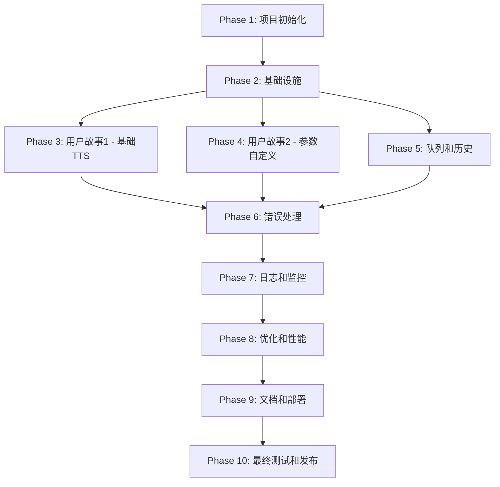

# Implementation Tasks: 离线文字转语音工具

**Feature Branch**: `001-offline-tts`
**Generated**: 2026-01-24
**Spec**: [spec.md](./spec.md) | Plan: [plan.md](./plan.md)

## Overview

本文档包含离线文字转语音工具的完整实施任务分解,包括所有开发任务和测试任务。任务按用户故事组织,支持独立实施和测试。

**测试覆盖**:
- ✅ 单元测试 (Unit Tests)
- ✅ API测试 (API/Contract Tests)
- ✅ 集成测试 (Integration Tests)
- ✅ 端到端测试 (End-to-End Tests)

**用户故事优先级**:
- P1: 基础文字转语音 (MVP核心)
- P2: 语音参数自定义
- P3: 批量文本处理 (Out of Scope for MVP)

---

## Phase 1: 项目初始化

**目标**: 搭建开发环境和项目基础结构

**独立验收标准**:
- [ ] 后端和前端项目结构已创建
- [ ] 所有依赖已安装,开发服务器可正常启动
- [ ] 代码规范工具已配置

### 任务清单

- [ ] T001 创建后端项目目录结构 backend/src/{api,models,services,core}
- [ ] T002 创建前端项目并初始化Vue 3 + TypeScript + Vite
- [ ] T003 创建Python虚拟环境并安装依赖 (requirements.txt)
- [ ] T004 [P] 配置后端代码规范工具 (Black, Ruff, mypy) in backend/pyproject.toml
- [ ] T005 [P] 配置前端代码规范工具 (ESLint, Prettier) in frontend/.eslintrc.cjs
- [ ] T006 [P] 创建.env环境变量模板 files in backend/.env.example and frontend/.env.example
- [ ] T007 创建data/, output/, logs/ directories in backend/
- [ ] T008 配置.gitignore文件排除虚拟环境和敏感文件
- [ ] T009 创建README.md说明项目结构和启动方式
- [ ] T010 初始化Git仓库并创建初始提交

---

## Phase 2: 基础设施

**目标**: 实现共享基础设施,为所有用户故事提供支撑

**独立验收标准**:
- [ ] 数据库已初始化,表结构已创建
- [ ] FastAPI应用可正常启动,健康检查端点可访问
- [ ] 日志系统正常工作
- [ ] CORS配置正确,前端可调用后端API

### 后端基础设施

- [ ] T011 创建数据库连接模块 backend/src/core/database.py with SQLAlchemy 2.0 async engine
- [ ] T012 [P] 创建Base模型类 backend/src/models/base.py
- [ ] T013 [P] 创建日志配置模块 backend/src/core/logger.py with file rotation
- [ ] T014 [P] 创建配置管理模块 backend/src/core/config.py using pydantic-settings
- [ ] T015 [P] 创建安全验证模块 backend/src/core/security.py with input sanitization
- [ ] T016 创建FastAPI应用入口 backend/src/main.py with CORS middleware
- [ ] T017 实现健康检查端点 backend/src/api/health.py

### 前端基础设施

- [ ] T018 [P] 创建Axios实例配置 frontend/src/services/http.ts with base URL and interceptors
- [ ] T019 [P] 创建TypeScript类型定义 frontend/src/types/api.ts for API requests/responses
- [ ] T020 [P] 创建错误处理工具 frontend/src/utils/error-handler.ts

### 测试基础设施

- [ ] T021 配置pytest测试框架 backend/tests/conftest.py with async client fixture
- [ ] T022 [P] 配置Vitest测试框架 frontend/vitest.config.ts
- [ ] T023 [P] 创建测试工具函数 backend/tests/utils.py for database and fixtures

---

## Phase 3: 用户故事 1 - 基础文字转语音 (P1) ⭐ MVP

**目标**: 实现核心文字转语音功能

**用户故事**: 用户输入想要转换为语音的文字内容,选择语音参数,生成MP3格式的音频文件并下载到本地

**独立验收标准**:
- [ ] 用户可以输入文本并生成MP3音频文件
- [ ] 生成的音频文件可以成功下载
- [ ] 空文本输入会显示友好的错误提示
- [ ] 所有单元测试通过 (models, services, api)
- [ ] 所有API契约测试通过
- [ ] 集成测试通过 (端到端TTS生成流程)
- [ ] 端到端测试通过 (完整用户旅程)

### 3.1 数据模型层

- [ ] T024 [US1] 创建Task模型 backend/src/models/task.py with SQLAlchemy 2.0 async ORM
- [ ] T025 [P] [US1] 为Task模型创建Pydantic schemas backend/src/api/schemas.py
- [ ] T026 [P] [US1] 编写Task模型单元测试 backend/tests/unit/test_task_model.py
- [ ] T027 [US1] 创建History模型 backend/src/models/history.py
- [ ] T028 [P] [US1] 编写History模型单元测试 backend/tests/unit/test_history_model.py

### 3.2 服务层

- [ ] T029 [US1] 创建TTSService基础类 backend/src/services/tts_service.py
- [ ] T030 [US1] 实现edge-tts引擎封装 backend/src/services/tts_service.py with async generation
- [ ] T031 [P] [US1] 编写TTS生成单元测试 backend/tests/unit/test_tts_service.py with mocked edge-tts
- [ ] T032 [US1] 实现文件存储服务 backend/src/services/storage_service.py for audio files
- [ ] T033 [P] [US1] 编写文件存储服务单元测试 backend/tests/unit/test_storage_service.py
- [ ] T034 [US1] 实现任务队列服务 backend/src/services/queue_service.py with asyncio.Queue
- [ ] T035 [P] [US1] 编写任务队列服务单元测试 backend/tests/unit/test_queue_service.py
- [ ] T036 [US1] 实现历史记录服务 backend/src/services/history_service.py
- [ ] T037 [P] [US1] 编写历史记录服务单元测试 backend/tests/unit/test_history_service.py

### 3.3 API层

- [ ] T038 [US1] 创建TTS API路由 backend/src/api/tts.py
- [ ] T039 [US1] 实现POST /api/v1/tts/generate端点 with validation
- [ ] T040 [US1] 实现GET /api/v1/tts/tasks/{task_id}端点
- [ ] T041 [US1] 实现DELETE /api/v1/tts/tasks/{task_id}端点 (cancel)
- [ ] T042 [US1] 实现GET /api/v1/tts/download/{task_id}端点 with file streaming
- [ ] T043 [P] [US1] 编写TTS API契约测试 backend/tests/contract/test_tts_api.py against OpenAPI spec
- [ ] T044 [P] [US1] 编写TTS API集成测试 backend/tests/integration/test_tts_flow.py

### 3.4 前端组件层

- [ ] T045 [US1] 创建TTS服务封装 frontend/src/services/tts.ts
- [ ] T046 [US1] 创建主页面组件 frontend/src/views/Home.vue with layout
- [ ] T047 [US1] 实现文本输入组件 frontend/src/components/TTSInput.vue with character count
- [ ] T048 [P] [US1] 编写TTSInput组件单元测试 frontend/tests/unit/TTSInput.test.ts
- [ ] T049 [US1] 实现生成按钮和加载状态 frontend/src/views/Home.vue
- [ ] T050 [US1] 实现音频下载功能 frontend/src/views/Home.vue with blob handling
- [ ] T051 [P] [US1] 编写TTS服务单元测试 frontend/tests/unit/tts.test.ts with mocked HTTP
- [ ] T052 [P] [US1] 编写Home页面组件测试 frontend/tests/unit/Home.test.ts

### 3.5 端到端测试

- [ ] T053 [US1] 编写后端E2E测试 backend/tests/e2e/test_tts_complete_flow.py
  - 场景1: 输入"你好,世界"生成并下载音频
  - 场景2: 输入空文本验证错误提示
  - 场景3: 输入5000字符文本验证正常生成
- [ ] T054 [US1] 编写前端E2E测试 frontend/tests/e2e/tts-generation.spec.ts using Playwright
  - 场景1: 完整的TTS生成流程(输入→生成→下载)
  - 场景2: 验证错误提示显示
  - 场景3: 验证字符计数功能

---

## Phase 4: 用户故事 2 - 语音参数自定义 (P2)

**目标**: 实现语音参数调节功能

**用户故事**: 用户可以调整语音的基础参数(如语速、音调、音量、音色等),以获得更符合需求的语音效果

**独立验收标准**:
- [ ] 用户可以调整语速参数并生效
- [ ] 用户可以调整音调参数并生效
- [ ] 用户可以调整音量参数并生效
- [ ] 用户可以选择不同音色并生效
- [ ] 重置参数功能正常工作
- [ ] 所有参数的单元测试通过
- [ ] API契约测试通过
- [ ] 集成测试验证参数正确传递到edge-tts

### 4.1 后端扩展

- [ ] T055 [US2] 扩展TaskCreateRequest schema添加参数验证 backend/src/api/schemas.py
- [ ] T056 [US2] 实现音色列表配置 backend/src/core/config.py with PRESET_VOICES
- [ ] T057 [US2] 实现GET /api/v1/voices端点 backend/src/api/tts.py
- [ ] T058 [P] [US2] 编写参数验证单元测试 backend/tests/unit/test_param_validation.py
- [ ] T059 [P] [US2] 编写voices端点契约测试 backend/tests/contract/test_voices_api.py

### 4.2 前端UI组件

- [ ] T060 [US2] 创建语音参数组件 frontend/src/components/VoiceParams.vue
- [ ] T061 [US2] 实现语速滑块控件 frontend/src/components/VoiceParams.vue with 0.5-2.0 range
- [ ] T062 [US2] 实现音调滑块控件 frontend/src/components/VoiceParams.vue with 0.5-2.0 range
- [ ] T063 [US2] 实现音量滑块控件 frontend/src/components/VoiceParams.vue with 0.0-1.0 range
- [ ] T064 [US2] 实现音色选择器 frontend/src/components/VoiceParams.vue with Element Plus Select
- [ ] T065 [US2] 实现重置参数按钮 frontend/src/components/VoiceParams.vue
- [ ] T066 [P] [US2] 编写VoiceParams组件单元测试 frontend/tests/unit/VoiceParams.test.ts
- [ ] T067 [P] [US2] 编写参数组件集成测试 frontend/tests/integration/params-flow.test.ts

### 4.3 集成和E2E测试

- [ ] T068 [US2] 编写参数传递集成测试 backend/tests/integration/test_params_flow.py
  - 验证参数正确传递到edge-tts
  - 验证参数边界值处理
- [ ] T069 [US2] 编写参数UI交互E2E测试 frontend/tests/e2e/params-customization.spec.ts
  - 场景1: 调整语速到1.5倍并验证效果
  - 场景2: 切换音色并验证效果
  - 场景3: 使用重置按钮恢复默认值

---

## Phase 5: 用户故事 3 - 任务队列和历史记录 (P2+P1)

**目标**: 实现任务队列管理和生成历史记录功能

**用户故事**:
- 队列: 系统显示当前队列状态,允许用户取消排队任务
- 历史: 用户可以查看生成历史并重新下载音频文件

**独立验收标准**:
- [ ] 队列状态正确显示(排队/处理/完成数量)
- [ ] 用户可以取消排队中的任务
- [ ] 历史记录显示最近20条记录
- [ ] 历史记录自动清理超过20条
- [ ] 用户可以删除历史记录
- [ ] 用户可以从历史记录重新下载音频
- [ ] 所有API测试通过
- [ ] 集成测试验证队列和历史的正确性

### 5.1 队列管理后端

- [ ] T070 [US1+US2] 实现GET /api/v1/queue/status端点 backend/src/api/queue.py
- [ ] T071 [P] [US1+US2] 编写队列状态API契约测试 backend/tests/contract/test_queue_api.py
- [ ] T072 [US1+US2] 增强队列服务支持状态查询 backend/src/services/queue_service.py

### 5.2 历史记录后端

- [ ] T073 [US1+US2] 实现GET /api/v1/history端点 backend/src/api/history.py
- [ ] T074 [US1+US2] 实现DELETE /api/v1/history/{id}端点 backend/src/api/history.py
- [ ] T075 [US1+US2] 实现DELETE /api/v1/history/clear端点 backend/src/api/history.py
- [ ] T076 [P] [US1+US2] 编写历史API契约测试 backend/tests/contract/test_history_api.py
- [ ] T077 [P] [US1+US2] 编写历史自动清理单元测试 backend/tests/unit/test_history_auto_cleanup.py
- [ ] T078 [US1+US2] 编写历史API集成测试 backend/tests/integration/test_history_flow.py

### 5.3 队列和历史前端

- [ ] T079 [US1+US2] 创建队列状态Pinia store frontend/src/stores/queue.ts
- [ ] T080 [US1+US2] 创建历史记录Pinia store frontend/src/stores/history.ts
- [ ] T081 [US1+US2] 创建队列服务封装 frontend/src/services/queue.ts
- [ ] T082 [US1+US2] 创建历史服务封装 frontend/src/services/history.ts
- [ ] T083 [US1+US2] 实现队列状态组件 frontend/src/components/QueueStatus.vue
- [ ] T084 [US1+US2] 实现历史记录列表组件 frontend/src/components/HistoryList.vue
- [ ] T085 [US1+US2] 创建历史记录页面 frontend/src/views/History.vue
- [ ] T086 [P] [US1+US2] 编写队列store单元测试 frontend/tests/unit/queue.test.ts
- [ ] T087 [P] [US1+US2] 编写历史store单元测试 frontend/tests/unit/history.test.ts
- [ ] T088 [P] [US1+US2] 编写队列组件单元测试 frontend/tests/unit/QueueStatus.test.ts
- [ ] T089 [P] [US1+US2] 编写历史组件单元测试 frontend/tests/unit/HistoryList.test.ts

### 5.4 集成和E2E测试

- [ ] T090 [US1+US2] 编写队列管理集成测试 backend/tests/integration/test_queue_management.py
  - 验证FIFO顺序
  - 验证任务取消
  - 验证队列满载处理
- [ ] T091 [US1+US2] 编写历史记录集成测试 backend/tests/integration/test_history_management.py
  - 验证历史记录创建
  - 验证自动清理(FIFO)
  - 验证删除功能
- [ ] T092 [US1+US2] 编写队列和历史E2E测试 frontend/tests/e2e/queue-and-history.spec.ts
  - 场景1: 提交多个任务并查看队列状态
  - 场景2: 取消排队中的任务
  - 场景3: 查看历史记录并重新下载
  - 场景4: 删除历史记录

---

## Phase 6: 错误处理和边界情况

**目标**: 完善错误处理和边界情况处理

**独立验收标准**:
- [ ] 所有边缘情况都有对应的错误处理
- [ ] 错误消息友好且可操作
- [ ] 安全验证正常工作
- [ ] 错误处理测试覆盖率达标

### 后端错误处理

- [ ] T093 实现文本长度验证中间件 backend/src/core/security.py
- [ ] T094 [P] 实现路径遍历防护 backend/src/core/security.py with path sanitization
- [ ] T095 [P] 实现命令注入防护 backend/src/core/security.py with input escaping
- [ ] T096 [P] 增强TTSService错误处理 backend/src/services/tts_service.py with retry logic
- [ ] T097 [P] 实现全局异常处理器 backend/src/main.py with custom error responses
- [ ] T098 [P] 编写安全验证单元测试 backend/tests/unit/test_security.py
- [ ] T099 [P] 编写错误处理集成测试 backend/tests/integration/test_error_handling.py

### 前端错误处理

- [ ] T100 实现全局错误处理器 frontend/src/utils/error-handler.ts
- [ ] T101 [P] 增强API拦截器错误处理 frontend/src/services/http.ts
- [ ] T102 [P] 实现用户友好的错误提示组件 frontend/src/components/ErrorMessage.vue
- [ ] T103 [P] 编写错误处理单元测试 frontend/tests/unit/error-handler.test.ts

### 边缘情况测试

- [ ] T104 编写边界情况E2E测试 frontend/tests/e2e/edge-cases.spec.ts
  - 场景1: 输入5001字符验证错误提示
  - 场景2: 输入路径遍历字符验证安全拦截
  - 场景3: 快速连续点击生成按钮验证防重复提交
  - 场景4: 队列满载时提交任务验证错误提示
  - 场景5: 生成失败时验证错误消息显示

---

## Phase 7: 日志和监控

**目标**: 实现完整的日志记录和基础监控

**独立验收标准**:
- [ ] 所有错误都有日志记录
- [ ] 任务生命周期事件有日志记录
- [ ] 关键操作有日志记录
- [ ] 日志文件按日期滚动
- [ ] 日志格式统一且可解析

### 后端日志系统

- [ ] T105 实现任务生命周期日志记录 backend/src/services/tts_service.py
- [ ] T106 [P] 实现关键操作日志记录 backend/src/services/history_service.py
- [ ] T107 [P] 实现错误日志增强 backend/src/core/logger.py with context
- [ ] T108 [P] 配置日志滚动 backend/src/core/logger.py with TimedRotatingFileHandler
- [ ] T109 [P] 编写日志系统单元测试 backend/tests/unit/test_logger.py
- [ ] T110 [P] 编写日志记录集成测试 backend/tests/integration/test_logging.py

---

## Phase 8: 优化和性能

**目标**: 优化性能和用户体验

**独立验收标准**:
- [ ] 生成时间< 10秒 (500字符文本)
- [ ] 全流程时间< 30秒
- [ ] 前端响应流畅,无卡顿
- [ ] 资源使用合理

### 后端优化

- [ ] T111 实现TTS生成性能优化 backend/src/services/tts_service.py with caching
- [ ] T112 [P] 实现数据库连接池优化 backend/src/core/database.py
- [ ] T113 [P] 编写性能测试 backend/tests/performance/test_tts_performance.py

### 前端优化

- [ ] T114 实现组件懒加载 frontend/src/main.ts with route-based code splitting
- [ ] T115 [P] 实现请求防抖(debounce) frontend/src/utils/debounce.ts
- [ ] T116 [P] 优化音频下载体验 frontend/src/views/Home.vue with progress indicator

---

## Phase 9: 文档和部署

**目标**: 完善文档和准备部署

**独立验收标准**:
- [ ] API文档完整
- [ ] 用户手册完整
- [ ] 开发者文档完整
- [ ] 可以一键启动开发环境
- [ ] 可以打包部署

### 文档

- [ ] T117 完善API文档 backend/docs/api.md with examples
- [ ] T118 [P] 创建用户使用手册 docs/user-guide.md
- [ ] T119 [P] 更新README.md with setup instructions
- [ ] T120 [P] 创建部署文档 docs/deployment.md

### 部署准备

- [ ] T121 创建Docker配置 backend/Dockerfile
- [ ] T122 [P] 创建前端构建配置 frontend/vite.config.ts for production
- [ ] T123 [P] 创建部署脚本 scripts/deploy.sh
- [ ] T124 [P] 编写部署测试测试/deployment/test-deployment.sh

---

## Phase 10: 最终测试和发布

**目标**: 全面的质量保证和发布准备

**独立验收标准**:
- [ ] 所有单元测试通过 (覆盖率>80%)
- [ ] 所有集成测试通过
- [ ] 所有E2E测试通过
- [ ] 性能测试通过
- [ ] 安全测试通过
- [ ] 代码审查通过
- [ ] 文档审查通过

### 测试

- [ ] T125 运行完整测试套件并确保通过 scripts/test-all.sh
- [ ] T126 [P] 执行代码覆盖率检查并生成报告 scripts/coverage.sh
- [ ] T127 [P] 执行性能基准测试 scripts/benchmark.sh
- [ ] T128 [P] 执行安全扫描 scripts/security-scan.sh

### 发布

- [ ] T129 代码规范检查 (Black, Ruff, mypy, ESLint)
- [ ] T130 [P] 创建Git tag v1.0.0
- [ ] T131 [P] 编写CHANGELOG.md
- [ ] T132 [P] 创建发布说明 docs/release-notes/v1.0.0.md

---

## 依赖关系图

**并行执行机会**:
- Phase 1中所有任务可并行执行
- Phase 2中基础设施任务可部分并行
- 各用户故事内的标记[P]的任务可并行
- Phase 6-9中的标记[P]的任务可并行

---

## 实施策略

### MVP范围 (最小可行产品)

**包含**:
- ✅ Phase 1-3 (项目初始化 + 基础TTS功能)
- ✅ 基础错误处理
- ✅ 核心测试覆盖

**不包含** (可延后到v1.1):
- ⏸️ 高级参数自定义 (US2部分功能)
- ⏸️ 队列和历史记录 (US5)
- ⏸️ 性能优化
- ⏸️ Docker部署

### 增量交付计划

**Sprint 1 (Week 1-2)**:
- Phase 1-2: 项目搭建和基础设施
- 交付: 可运行的开发环境

**Sprint 2 (Week 3-4)**:
- Phase 3: 核心TTS功能
- 交付: 可生成和下载音频的MVP

**Sprint 3 (Week 5-6)**:
- Phase 4-5: 参数自定义 + 队列历史
- 交付: 功能完整的v1.0

**Sprint 4 (Week 7-8)**:
- Phase 6-10: 优化、测试、文档
- 交付: 生产就绪的v1.0

---

## 测试策略总览

### 单元测试 (Unit Tests)

**后端** (pytest):
- 目标覆盖率: >80%
- 测试内容:
  - 数据模型 (models/)
  - 业务逻辑 (services/)
  - 配置和工具 (core/)
- 运行命令: `pytest backend/tests/unit/`

**前端** (Vitest):
- 目标覆盖率: >70%
- 测试内容:
  - 组件逻辑
  - 服务函数
  - 工具函数
  - Pinia stores
- 运行命令: `npm run test:unit`

### API/契约测试 (Contract Tests)

**后端** (pytest + httpx):
- 验证API响应符合OpenAPI规范
- 测试所有端点的请求/响应Schema
- 运行命令: `pytest backend/tests/contract/`

### 集成测试 (Integration Tests)

**后端** (pytest + TestClient):
- 测试服务层和API层集成
- 测试数据库操作
- 测试异步任务流程
- 运行命令: `pytest backend/tests/integration/`

**前端** (Vitest + msw):
- 测试组件和服务集成
- Mock API响应
- 测试状态管理
- 运行命令: `npm run test:integration`

### 端到端测试 (E2E Tests)

**前端** (Playwright):
- 测试完整用户旅程
- 测试跨页面流程
- 测试真实浏览器交互
- 运行命令: `npm run test:e2e`

**后端** (pytest + httpx):
- 测试完整API流程
- 从请求到响应的完整链路
- 运行命令: `pytest backend/tests/e2e/`

### 测试覆盖率目标

| 层级 | 目标覆盖率 | 测试数量估算 |
|------|-----------|-------------|
| 单元测试 | >80% (后端), >70% (前端) | ~30个测试文件 |
| API测试 | 100% (所有端点) | ~10个测试文件 |
| 集成测试 | >60% (关键流程) | ~15个测试文件 |
| E2E测试 | 核心用户场景 | ~10个测试场景 |

---

## 任务统计

**总任务数**: 132
- Phase 1 (项目初始化): 10个任务
- Phase 2 (基础设施): 13个任务
- Phase 3 (用户故事1 - 基础TTS): 31个任务
- Phase 4 (用户故事2 - 参数自定义): 15个任务
- Phase 5 (队列和历史): 23个任务
- Phase 6 (错误处理): 12个任务
- Phase 7 (日志和监控): 6个任务
- Phase 8 (优化和性能): 6个任务
- Phase 9 (文档和部署): 8个任务
- Phase 10 (最终测试): 8个任务

**并行机会**: 约40%的任务标记为[P],可并行执行

**测试任务占比**: 约35%的任务是测试相关

---

**验证检查**:
- ✅ 所有任务遵循checklist格式 (`- [ ] TaskID ...`)
- ✅ 所有用户故事阶段任务包含story标签 ([US1], [US2], [US1+US2])
- ✅ 所有并行任务标记为[P]
- ✅ 所有任务包含具体文件路径
- ✅ 每个用户故事可独立测试
- ✅ MVP范围明确 (Phase 1-3)
- ✅ 测试覆盖完整 (单元 + API + 集成 + E2E)

---

**下一步**: 开始执行Phase 1任务,从T001创建项目目录结构开始。
